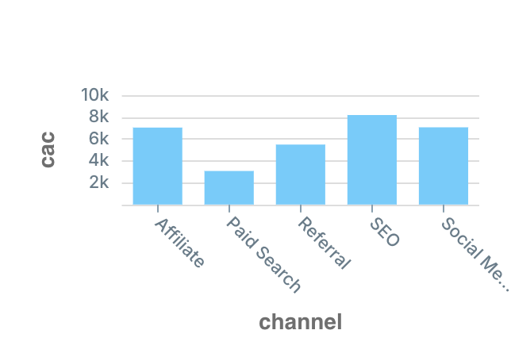
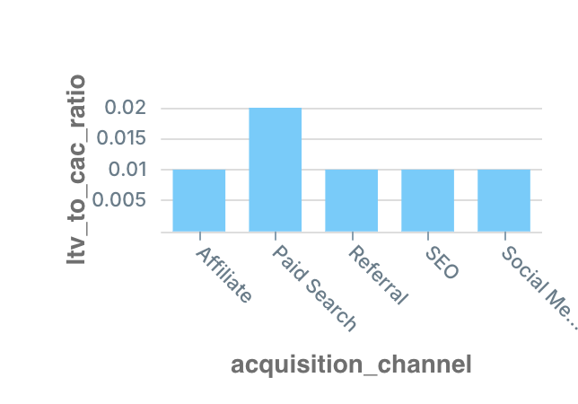

# 📊 FP&A SQL Project: Customer Acquisition & Revenue Analysis  
**Industry Simulated: HealthTech / Media (HIMS-inspired)**

This project simulates an end-to-end **Financial Planning & Analysis (FP&A)** workflow for a direct-to-consumer, subscription-based business — modeled after **Hims & Hers** and similar podcast or telehealth platforms. Using SQL and synthetic datasets, the analysis focuses on:

- **Customer Acquisition Cost (CAC)**
- **Customer Lifetime Value (LTV)**
- **LTV-to-CAC Ratio**
- **Marketing Channel Performance**

---

## 🛠 Tools & Stack

- **SQL:** MySQL 8.0  
- **Editor:** PopSQL  
- **Data Source:** Synthetic data (3 core tables: `customers`, `orders`, `marketing_spend`)

---

## 📁 Database Schema

```sql
USE HIMS;
SHOW TABLES;
```

- `customers` – Customer signup data including acquisition channel and signup date  
- `orders` – Revenue records tied to each customer  
- `marketing_spend` – Monthly spend per marketing channel

Sample preview:
```sql
SELECT * FROM marketing_spend LIMIT 100;
SELECT * FROM customers LIMIT 100;
SELECT * FROM orders LIMIT 100;
```

---

## 1️⃣ Customer Acquisition Cost (CAC)

> **Goal:** Understand how much it costs to acquire each customer by channel.

```sql
SELECT ms.channel,
       COUNT(DISTINCT c.customer_id) AS acquired_customers,
       ROUND(SUM(ms.spend_amount), 2) AS total_spend,
       ROUND(SUM(ms.spend_amount) / COUNT(DISTINCT c.customer_id), 2) AS cac
FROM marketing_spend ms
JOIN customers c
  ON DATE_FORMAT(c.signup_date, '%Y-%m-01') = ms.spend_date
 AND c.acquisition_channel = ms.channel
GROUP BY ms.channel
ORDER BY cac;
```



🔍 **Insight:** CACs are extremely high (some >$20,000), suggesting inefficient marketing allocation.

---

## 2️⃣ Lifetime Value (LTV)

> **Goal:** Evaluate total and average revenue per customer.

**Top 100 Customers by LTV:**
```sql
SELECT o.customer_id,
       ROUND(SUM(o.revenue), 2) AS LTV
FROM orders o 
GROUP BY o.customer_id
ORDER BY LTV DESC
LIMIT 100;
```

**Average Spend Per Order:**
```sql
SELECT customer_id,
       ROUND(AVG(revenue), 2) AS avg_spend
FROM orders
GROUP BY customer_id
ORDER BY avg_spend DESC;
```

---

## 3️⃣ LTV to CAC Ratio

> **Goal:** Assess marketing efficiency by comparing revenue (LTV) to acquisition cost (CAC).

```sql
SELECT
  c.acquisition_channel,
  ROUND(AVG(o.revenue), 2) AS avg_ltv,
  ROUND(SUM(ms.spend_amount) / COUNT(DISTINCT c.customer_id), 2) AS cac,
  ROUND(AVG(o.revenue) / (SUM(ms.spend_amount) / COUNT(DISTINCT c.customer_id)), 2) AS ltv_to_cac_ratio
FROM customers c
JOIN orders o ON c.customer_id = o.customer_id
JOIN marketing_spend ms 
  ON c.acquisition_channel = ms.channel
 AND DATE_FORMAT(c.signup_date, '%Y-%m-01') = ms.spend_date
GROUP BY c.acquisition_channel
ORDER BY ltv_to_cac_ratio DESC;
```



🔍 **Insight:** The highest LTV/CAC ratio is only **0.02**, meaning the company is spending $1 to generate just **2 cents** in revenue.

---

## 4️⃣ Full Marketing Channel Performance Overview

```sql
SELECT 
  c.acquisition_channel,
  COUNT(DISTINCT c.customer_id) AS new_customers,
  ROUND(SUM(o.revenue), 2) AS total_revenue,
  ROUND(SUM(ms.spend_amount), 2) AS total_spend
FROM customers c
JOIN orders o ON c.customer_id = o.customer_id
LEFT JOIN marketing_spend ms 
  ON c.acquisition_channel = ms.channel
 AND DATE_FORMAT(c.signup_date, '%Y-%m-01') = ms.spend_date
GROUP BY c.acquisition_channel;
```

---

## ✅ Business Recommendations

- **🔁 Reallocate Budget:** Cut spend on underperforming channels like **SEO** and **Social Media**.  
- **📦 Improve Monetization:** Increase LTV through **bundles**, **tiered plans**, or **upsells**.  
- **🎯 Target High-ROI Segments:** Focus future spend on historically profitable customer profiles.  
- **🔍 Optimize Paid Search:** This channel has the least bad LTV/CAC — test strategies to enhance it.

---

## 📌 Project Summary

This SQL-based FP&A case study showcases how analysts can extract strategic business insights from operational data — helping drive informed decisions on marketing efficiency, revenue performance, and customer value.
